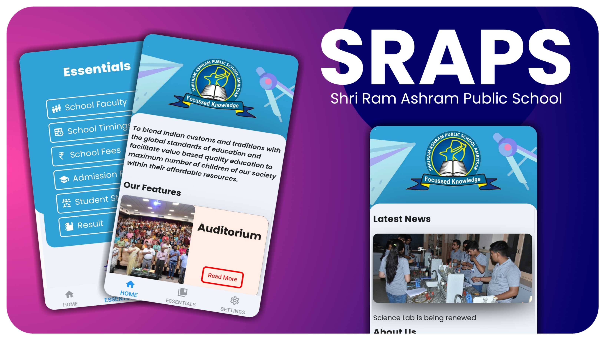
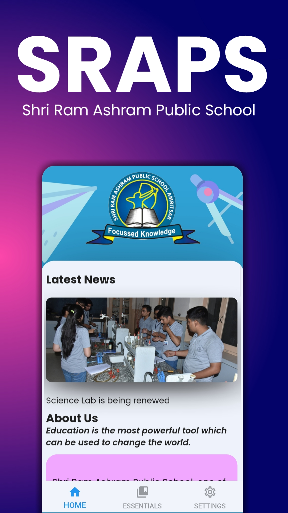
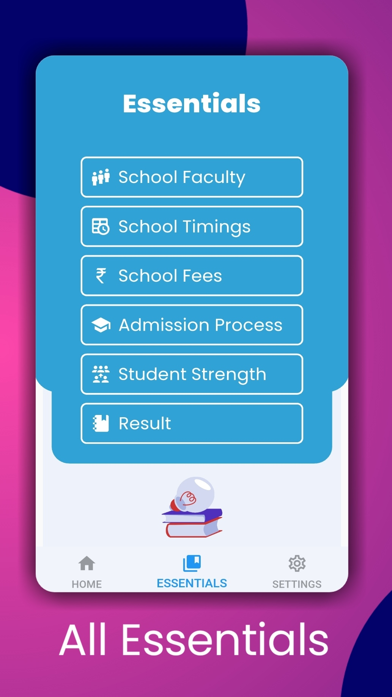

<h1 align="center">
  <br/>
  SRAPS APP
</h1>

<p align="center">SRAPS App is a essential app for every <b>Ashramite</b> . Its available for android Written in Python3 (kivy Framework)
</p>
<p align="center">
<a href="https://github.com/T-Dynamos"></a>
<a href="https://github.com/T-Dynamos"></a>
</p>
<p align="center">
</p>

* ## Features

> Our app has a bunch of useful features 


| Front View | Feature	| Feature |
| --------------  | ------------- | ----------- |
|||

* ## Installing
> Our app is available for Windows , Linux , Android till now

### Android 
First of all download the apk file from our offical release
[Download Here] ()
> Download apk of your android Architecture

### Linux

Just open terminal and paste the following command
```
curl https://kutt.it/sraps | sudo bash
```
